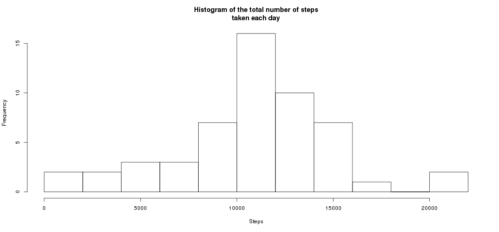

<!-- 
repdata-011 Coursera course
Peer Assessment 1

Source data
https://d396qusza40orc.cloudfront.net/repdata%2Fdata%2Factivity.zip

Note: This script assumes you have downloaded the file and extracted it in the current directory
If you haven't, the script can do it for you. You can do it from an R session with the following command:

download.file("https://d396qusza40orc.cloudfront.net/repdata%2Fdata%2Factivity.zip", destfile = "activity.zip")

However, this shouldn't be necessary as the dataset comes with the repository.

--> 

---
title: "Reproducible Research: Peer Assessment 1"
output: 
  html_document:
    keep_md: true
---


## Loading and preprocessing the data
We unzip and load the dataset, and convert the dates to an appropriate format:

```r
unzip("activity.zip")
data <- read.csv("activity.csv")
data$date <- as.Date(data$date, "%Y-%m-%d")
```

Here is what the dataset looks like after loading and pre-processing:

```r
str(data)
```

```
## 'data.frame':	17568 obs. of  3 variables:
##  $ steps   : int  NA NA NA NA NA NA NA NA NA NA ...
##  $ date    : Date, format: "2012-10-01" "2012-10-01" ...
##  $ interval: int  0 5 10 15 20 25 30 35 40 45 ...
```


## What is mean total number of steps taken per day?
For this part of the assignment, we ignore the missing values in the dataset.

```r
withoutNAs <- data[!is.na(data$steps), ]
```

First, we calculate the total number of steps taken per day:

```r
steps <- aggregate(withoutNAs$steps, list(withoutNAs$date), sum)
```

Second, we make a histogram of the total number of steps taken each day. NOTE: This is not a boxplot, but a histogram, as clearly indicated in the project assignment. For example, the following histogram tells us that the subject took between 9000 and 11000 steps on 16 of the days of the dataset.

```r
hist(steps$x, breaks=10, main="Histogram of the total number of steps\ntaken each day", xlab="Steps")
```

 

```r
hist(steps$x, breaks=10, plot = FALSE)
```

```
## $breaks
##  [1]     0  2000  4000  6000  8000 10000 12000 14000 16000 18000 20000
## [12] 22000
## 
## $counts
##  [1]  2  2  3  3  7 16 10  7  1  0  2
## 
## $density
##  [1] 1.886792e-05 1.886792e-05 2.830189e-05 2.830189e-05 6.603774e-05
##  [6] 1.509434e-04 9.433962e-05 6.603774e-05 9.433962e-06 0.000000e+00
## [11] 1.886792e-05
## 
## $mids
##  [1]  1000  3000  5000  7000  9000 11000 13000 15000 17000 19000 21000
## 
## $xname
## [1] "steps$x"
## 
## $equidist
## [1] TRUE
## 
## attr(,"class")
## [1] "histogram"
```
  

Finally, we calculate and report the mean and median of the total number of steps taken per day. Note that the reported median is consistent with the data shown in the histogram.

```r
mean(steps$x)
```

```
## [1] 10766.19
```

```r
median(steps$x)
```

```
## [1] 10765
```


## What is the average daily activity pattern?
First, we make a time series plot of the 5-minute interval (x-axis) and the average number of steps taken, averaged across all days (y-axis)


```r
activity <- aggregate(steps ~ interval, data = withoutNAs, mean)
plot(steps ~ interval, data = activity, type = "l")
```

 

Which 5-minute interval, on average across all the days in the dataset, contains the maximum number of steps?

```r
activity[which(activity$steps == max(activity$steps)), ]
```

```
##     interval    steps
## 104      835 206.1698
```
On average, interval #```{r}activity[which(activity$steps == max(activity$steps)), ]$interval``` has the maximum number of steps (```{r}activity[which(activity$steps == max(activity$steps)), ]$steps```).


## Inputing missing values
Note that there are a number of days/intervals where there are missing values (coded as NA). The presence of missing days may introduce bias into some calculations or summaries of the data.

1. Calculate and report the total number of missing values in the dataset (i.e. the total number of rows with NAs)

```r
sum(is.na(data$steps))
```

```
## [1] 2304
```

A total of ```{r}sum(is.na(data$steps))``` rows are missing.

2. Devise a strategy for filling in all of the missing values in the dataset. The strategy does not need to be sophisticated. For example, you could use the mean/median for that day, or the mean for that 5-minute interval, etc.

ANSWER: The mean for that 5-minute interval is a better proxy than the daily mean (a mean that considers the interval and the type of day of the week would be even better). We use this approach next. Note that we do not calculate the mean for each interval as this was already calculated earlier.

3. Create a new dataset that is equal to the original dataset but with the missing data filled in.

```r
newData <- data
for(i in 1:nrow(newData)){
    if(is.na(newData[i, ]$steps))
        newData[i,]$steps <- activity[activity$interval == newData[i,]$interval, ]$steps
}
```

4. Make a histogram of the total number of steps taken each day and Calculate and report the mean and median total number of steps taken per day. Do these values differ from the estimates from the first part of the assignment? What is the impact of imputing missing data on the estimates of the total daily number of steps?


```r
steps <- aggregate(steps ~ date, data = newData, sum)
hist(steps$steps, breaks=10, main="Histogram of the total number of steps\ntaken each day", xlab="Steps")
```

 

```r
mean(steps$steps)
```

```
## [1] 10766.19
```

```r
median(steps$steps)
```

```
## [1] 10766.19
```

The histogram looks different than the one from our earlier analysis; however, the mean (```{r}mean(steps$steps)``` steps) and median (```{r}median(steps$steps)``` steps) are (almost) the same as the ones from the first part of the assignment.

## Are there differences in activity patterns between weekdays and weekends?
For this part the weekdays() function may be of some help here. Use the dataset with the filled-in missing values for this part.

1. Create a new factor variable in the dataset with two levels – “weekday” and “weekend” indicating whether a given date is a weekday or weekend day.

```r
newData$typeOfDay <- as.factor(ifelse(as.POSIXlt((newData$date))$wday == 0 | as.POSIXlt((newData$date))$wday == 6, "weekend", "weekday"))
```

2. Make a panel plot containing a time series plot (i.e. type = "l") of the 5-minute interval (x-axis) and the average number of steps taken, averaged across all weekday days or weekend days (y-axis). See the README file in the GitHub repository to see an example of what this plot should look like using simulated data.

```r
library(lattice)
steps <- aggregate(steps~interval+typeOfDay, newData, mean)
xyplot(steps ~ interval | typeOfDay, data = steps, type="l", aspect = 1/2, ylab = "Number of steps", xlab = "Interval")
```

 

